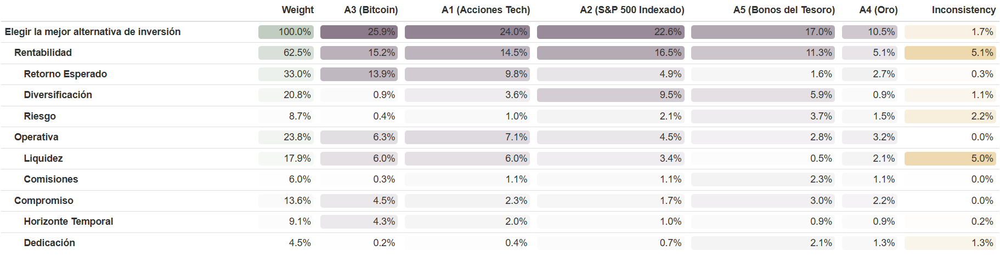
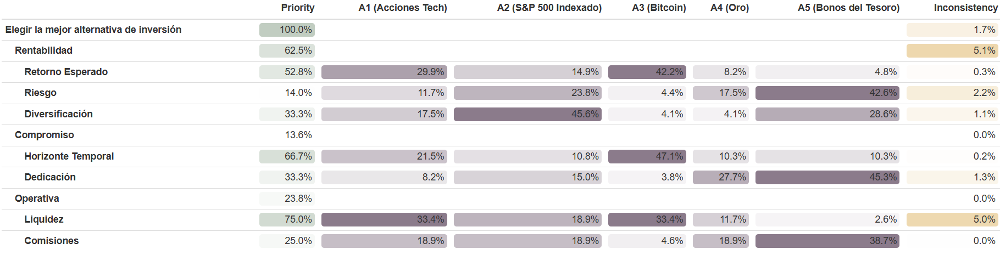

```{r setup, echo=FALSE, message=FALSE, warning=FALSE}
# Carga de las funciones necesarias
source("teoriadecision_funciones_multicriterio.R")
source("teoriadecision_funciones_multicriterio_diagram.R")
source("teoriadecision_funciones_multicriterio_utiles.R")

# Instalación y carga de paquetes

paquetes = c("formattable", "webshot2", "devtools", "kableExtra", 
              "factoextra", "diagram", "qgraph", "ggplot2", 
              "htmltools", "webshot", "knitr","dplyr")

for(p in paquetes){
  if(!require(p, character.only = TRUE)){
    install.packages(p)
    library(p, character.only = TRUE)
  } else {
    library(p, character.only = TRUE)
  }
}

# Paquete ahp (desde GitHub)
if(!require(ahp)) {
  devtools::install_github("calote/ahp")
  library(ahp)
} else {
  library(ahp)
}


```

# Introducción
Un joven acaba de heredar una suma importante de dinero y tras sopesarlo, ha decidido invertir ese dinero para poder sacar un mayor rendimiento. Tras una extensiva búsqueda, ha encontrado las 5 mejores alternativas de inversión, pero no termina de decidirse. Por ello, ha creado una lista con los 3 criterios, junto a unos subcriterios más concretos, que considera indispensables para cumplir su objetivo. Los criterios y subcriterios son los siguientes:

 
## Criterios

### **C.1 Rentabilidad (Prioridad Alta)**
Este criterio es el más relevante, ya que el objetivo principal del inversor es **maximizar el crecimiento del capital**.  
Incluye subcriterios relacionados con el rendimiento esperado, el nivel de riesgo asumido y el grado de diversificación del portafolio.

- **C.1.1 Retorno Esperado (Prioridad Alta)**  
  Representa el **porcentaje de beneficio anual esperado** de la inversión.  
  Es el subcriterio más importante, ya que refleja directamente la rentabilidad potencial del capital invertido.  
  *(Se busca Maximizar)*  

- **C.1.2 Riesgo (Prioridad Media)**  
  Mide la **volatilidad y la probabilidad de pérdida** asociada a la inversión.  
  Aunque se toleran niveles moderados de riesgo para obtener mayores rendimientos, debe mantenerse bajo control.  
  *(Se busca Minimizar)*  

- **C.1.3 Diversificación (Prioridad Media-Baja)**  
  Evalúa el **grado en que el capital se reparte entre distintos activos o sectores**, reduciendo la exposición a un único tipo de inversión.  
  Un portafolio diversificado contribuye a una mayor estabilidad del rendimiento a largo plazo.  
  *(Se busca Maximizar)*  


### **C.2 Compromiso (Prioridad Baja)**
Este criterio refleja el **grado de tiempo y dedicación** que el inversor está dispuesto a asumir.  
Aunque tiene una prioridad baja, influye en la gestión y planificación de las inversiones a medio y largo plazo.

- **C.2.1 Horizonte Temporal (Prioridad Baja)**  
  Indica el **tiempo mínimo recomendado** para mantener la inversión y alcanzar los objetivos de rentabilidad.  
  Un horizonte temporal más corto puede implicar mayor riesgo o menor estabilidad.  
  *(Se busca Minimizar)*  

- **C.2.2 Dedicación (Prioridad Baja)**  
  Representa las **horas semanales de seguimiento, análisis o gestión** que requiere la inversión.  
  El inversor prefiere estrategias con baja necesidad de supervisión activa.  
  *(Se busca Minimizar)*  


### **C.3 Operativa (Prioridad Media)**
Este criterio valora la **facilidad de gestión y operatividad** de la inversión, incluyendo aspectos de liquidez y costes asociados.

- **C.3.1 Liquidez (Prioridad Media)**  
  Evalúa la **facilidad y rapidez para convertir la inversión en dinero en efectivo sin pérdidas significativas**.  
  Es un factor importante para quienes buscan flexibilidad y acceso rápido al capital.  
  *(Se busca Maximizar)*  

- **C.3.2 Comisiones Anuales (Prioridad Media-Baja)**  
  Representa el **porcentaje de gastos o comisiones anuales** derivados de la inversión (gestión, custodia, mantenimiento, etc.).  
  Costes más bajos aumentan el rendimiento neto del inversor.  
  *(Se busca Minimizar)*  

  
   

## Alternativas de Inversión
Se presentan cinco alternativas de inversión que el inversor está considerando, junto con los datos relevantes para cada una de ellas:

 

### **A1: Acciones Tecnológicas**
- **C.1.1 Retorno Esperado:** 18%  
- **C.1.2 Riesgo:** 18  
- **C.1.3 Diversificación:** 5  
- **C.2.1 Horizonte Temporal:** 5 años  
- **C.2.2 Dedicación:** 5 h/semana  
- **C.3.1 Liquidez:** 10 puntos  
- **C.3.2 Comisiones Anuales:** 0.5%  


### **A2: Fondo Indexado (S&P 500)**
- **C.1.1 Retorno Esperado:** 9%  
- **C.1.2 Riesgo:** 13  
- **C.1.3 Diversificación:** 9  
- **C.2.1 Horizonte Temporal:** 8 años  
- **C.2.2 Dedicación:** 2 h/semana  
- **C.3.1 Liquidez:** 8 puntos  
- **C.3.2 Comisiones Anuales:** 0.5%  


### **A3: Criptomonedas (Bitcoin)**
- **C.1.1 Retorno Esperado:** 25%  
- **C.1.2 Riesgo:** 52.2  
- **C.1.3 Diversificación:** 1  
- **C.2.1 Horizonte Temporal:** 2 años  
- **C.2.2 Dedicación:** 8 h/semana  
- **C.3.1 Liquidez:** 10 puntos  
- **C.3.2 Comisiones Anuales:** 2%  


### **A4: Metales Preciosos (Oro)**
- **C.1.1 Retorno Esperado:** 5%  
- **C.1.2 Riesgo:** 15.5  
- **C.1.3 Diversificación:** 1  
- **C.2.1 Horizonte Temporal:** 10 años  
- **C.2.2 Dedicación:** 1 h/semana  
- **C.3.1 Liquidez:** 6 puntos  
- **C.3.2 Comisiones Anuales:** 0.5%  


### **A5: Bonos del Tesoro**
- **C.1.1 Retorno Esperado:** 3%  
- **C.1.2 Riesgo:** 6  
- **C.1.3 Diversificación:** 7  
- **C.2.1 Horizonte Temporal:** 10 años  
- **C.2.2 Dedicación:** 0 h/semana  
- **C.3.1 Liquidez:** 0 puntos  
- **C.3.2 Comisiones Anuales:** 0%  


Queda recogido en la siguiente tabla:
$$
\begin{array}{|c|c|ccccc|}
\hline
\textbf{Criterios / Subcriterios} & \textbf{Min/Max} & \text{Acciones Tech (A1)} & \text{Fondo Indexado (A2)} & \text{Bitcoin (A3)} & \text{Oro (A4)} & \text{Bonos del Tesoro (A5)} \\
\hline
\hline
\text{C.1.1 Retorno Esperado (\%)} & \text{Max} & 18 & 9 & 25 & 5 & 3 \\
\text{C.1.2 Riesgo (volatilidad, \%)} & \text{Min} & 18 & 13 & 52.2 & 15.5 & 6 \\
\text{C.1.3 Diversificación (1-10)} & \text{Max} & 5 & 9 & 1 & 1 & 7 \\
\text{C.2.1 Horizonte Temporal (años)} & \text{Min} & 5 & 8 & 2 & 10 & 10 \\
\text{C.2.2 Dedicación (h/semana)} & \text{Min} & 5 & 2 & 8 & 1 & 0 \\
\text{C.3.1 Liquidez (1-10)} & \text{Max} & 10 & 8 & 10 & 6 & 0 \\
\text{C.3.2 Comisiones anuales (\%)} & \text{Min} & 0.5 & 0.5 & 2 & 0.5 & 0 \\
\hline
\end{array}
$$

La construyo en R
```{r}
# Datos de la matriz de decisión


datos = data.frame(
  Subcriterio = c(
    "Retorno Esperado (%)",
    "Riesgo (volatilidad, %)",
    "Diversificación (1-10)",
    "Horizonte Temporal (años)",
    "Dedicación (h/semana)",
    "Liquidez (1-10)",
    "Comisiones anuales (%)"
  ),
  A1_Acciones_Tech = c(18, 18, 5, 5, 5, 10, 0.5),
  A2_SP500_Indexado = c(9, 13, 9, 8, 2, 8, 0.5),
  A3_Bitcoin = c(25, 52.2, 1, 2, 8, 10, 2),
  A4_Oro = c(5, 15.5, 1, 10, 1, 6, 0.5),
  A5_Bonos_Tesoro = c(3, 6, 7, 10, 0, 0, 0),
  Objetivo = c("Max", "Min", "Max", "Min", "Min", "Max", "Min"),
  stringsAsFactors = FALSE
)

# Tabla formateada en LaTeX
datos %>%
  kable(
    format = "latex",
    caption = "Matriz de Decisión Final para Alternativas de Inversión",
    col.names = c("Subcriterio",
                  "A1: Acciones Tech",
                  "A2: S&P 500 Indexado",
                  "A3: Bitcoin",
                  "A4: Oro",
                  "A5: Bonos del Tesoro",
                  "Objetivo"),
    align = c('l', rep('c', 5), 'c')
  ) %>%
  column_spec(1, width = "5cm", bold = TRUE) %>%
  add_header_above(c(" " = 1, "Alternativas de Inversión" = 5, " " = 1)) %>%
  kable_styling(latex_options = c("HOLD_position", "scale_down"), full_width = FALSE)

```


```{r}
# Matriz de decisión para cálculos multicriterio

matriz_decision = multicriterio.crea.matrizdecision(
  c(
    18, -18, 5, -5, -5, 10, -0.5,     
    9, -13, 9, -8, -2, 8, -0.5,       
    25, -52.2, 1, -2, -8, 10, -2,     
    5, -15.5, 1, -10, -1, 6, -0.5,    
    3, -6, 7, -10, 0, 0, -0           
  ),
  numalternativas = 5,
  numcriterios = 7,
  v.nombrescri = c(
    "Retorno Esperado (%)",
    "Riesgo (volatilidad, %)",
    "Diversificación (1-10)",
    "Horizonte Temporal (años)",
    "Dedicación (h/semana)",
    "Liquidez (1-10)",
    "Comisiones anuales (%)"
  ),
  v.nombresalt = c(
    "A1: Acciones Tech",
    "A2: S&P 500 Indexado",
    "A3: Bitcoin",
    "A4: Oro",
    "A5: Bonos del Tesoro"
  )
)

matriz_decision
```


# Método AHP

## Matriz de Criterios AHP 
$$
\begin{array}{|c|c|c|c|c|c|c|c|}
\hline
\textbf{Criterio / Criterio} & \text{Retorno} & \text{Riesgo} & \text{Diversificación} & \text{Horizonte} & \text{Dedicación} & \text{Liquidez} & \text{Comisiones} \\ 
\hline
\text{Retorno} & 1 & 4 & 3 & 5 & 6 & 4 & 5 \\
\text{Riesgo} & 1/4 & 1 & 3 & 4 & 5 & 6 & 4 \\
\text{Diversificación} & 1/3 & 1/3 & 1 & 2 & 3 & 3 & 4 \\
\text{Horizonte} & 1/5 & 1/4 & 1/2 & 1 & 2 & 3 & 3 \\
\text{Dedicación} & 1/6 & 1/5 & 1/3 & 1/2 & 1 & 2 & 2 \\
\text{Liquidez} & 1/4 & 1/6 & 1/3 & 1/3 & 1/2 & 1 & 4 \\
\text{Comisiones} & 1/5 & 1/4 & 1/4 & 1/3 & 1/2 & 1/4 & 1 \\
\hline
\end{array}
$$


Voy a razonar algunos pesos:
Retorno vs. Dedicación (6): El Retorno es el objetivo principal de la inversión, mientras que la Dedicación es un coste secundario y aceptable si la rentabilidad es alta.

Riesgo vs. Liquidez (6): El Riesgo (viabilidad de la cartera) es un pilar fundamental, mientras que la Liquidez (facilidad de venta) es solo un factor de conveniencia.

Retorno vs. Horizonte (5): El Retorno es el objetivo que define los medios; el Horizonte Temporal es una restricción que se adapta al potencial de rentabilidad esperado.

Riesgo vs. Dedicación (5): El Riesgo es un factor fundamental que define la inversión, mientras que la Dedicación es un coste operativo mucho menos relevante.


Construyo la matriz en R
```{r echo=FALSE}
Matriz_criterios = multicriterio.crea.matrizvaloraciones_mej(
  vector_valoraciones_diagsup = c(
    4, 3, 5, 6, 4, 5,   
    3, 4, 5, 6, 4,      
    2, 3, 3, 4,         
    1, 2, 3,            
    1, 2,               
    4                   
  ),
  numalternativas = 7,
  v.nombres.alternativas = c(
    "Retorno", "Riesgo", "Diversificación", 
    "Horizonte", "Dedicación", "Liquidez", "Comisiones"
  )
)
Matriz_criterios
```


## Matrices de alternativas
### C 1.1: Retorno Esperado (Maximizar)
$$
\begin{array}{|c|c|c|c|c|c|}
\hline
 & A_1 & A_2 & A_3 & A_4 & A_5 \\ \hline
A_1 & 1 & 3 & 1/4 & 5 & 8 \\
A_2 & 1/3 & 1 & 1/6 & 3 & 5 \\
A_3 & 4 & 6 & 1 & 8 & 9 \\
A_4 & 1/5 & 1/3 & 1/8 & 1 & 4 \\
A_5 & 1/8 & 1/5 & 1/9 & 1/4 & 1 \\ \hline
\end{array}
$$
Razonamiento de las más extremas

A5 (bonos) es la que genera menor rendmiento respecto a cualquiera, como queda reflejado

A3 (bitcoin) es la que mayor genera, por lo tanto tiene valores mayores a 0 frente a cualquier otra alternativa


### C 1.2: Riesgo (Minimizar)

$$
\begin{array}{|c|c|c|c|c|c|}
\hline
 & A_1 & A_2 & A_3 & A_4 & A_5 \\ \hline
A_1 & 1 & 3 & 1/6 & 5 & 6 \\
A_2 & 1/3 & 1 & 1/7 & 3 & 5 \\
A_3 & 6 & 7 & 1 & 9 & 9 \\
A_4 & 1/5 & 1/3 & 1/9 & 1 & 1/2 \\
A_5 & 1/6 & 1/5 & 1/9 & 2 & 1 \\ \hline
\end{array}
$$

A5 (Bonos del Tesoro, 6%) es la alternativa menos riesgosa frente a todas las demás, como se refleja en los valores altos frente a A3.

A3 (Bitcoin, 52.2%) es la alternativa más volátil, con valores elevados frente a cualquier otra alternativa.

### C 1.3: Diversificación (Maximizar)
$$
\begin{array}{|c|c|c|c|c|c|}
\hline
 & A_1 & A_2 & A_3 & A_4 & A_5 \\ \hline
A_1 & 1 & 1/5 & 8 & 8 & 7 \\
A_2 & 5 & 1 & 9 & 9 & 8 \\
A_3 & 1/8 & 1/9 & 1 & 1 & 1/2 \\
A_4 & 1/8 & 1/9 & 1 & 1 & 1/2 \\
A_5 & 1/7 & 1/8 & 2 & 2 & 1 \\ \hline
\end{array}
$$
A2 (Fondo Indexado, 9) es la alternativa con mayor diversificación; A3 (Bitcoin, 1) la que menor diversificación ofrece.

A2 vs A1 (5) refleja que el fondo indexado aporta una diversificación significativamente superior a las acciones tech.

A5 vs A4 (2) indica que los bonos aportan algo más de diversificación que el oro.

### C 2.1: Horizonte Temporal (Minimizar)
$$
\begin{array}{|c|c|c|c|c|c|}
\hline
 & A_1 & A_2 & A_3 & A_4 & A_5 \\ \hline
A_1 & 1 & 4 & 1/3 & 5 & 8 \\
A_2 & 1/4 & 1 & 1/6 & 6 & 1 \\
A_3 & 3 & 6 & 1 & 8 & 9 \\
A_4 & 1/5 & 1/6 & 1/8 & 1 & 3 \\
A_5 & 1/8 & 1/7 & 1/9 & 1/3 & 1 \\ \hline
\end{array}
$$
A3 (Bitcoin, 2 años) tiene el horizonte temporal más corto, por lo que es la mejor opción para inversiones a plazo menor.

A4 y A5 (Oro y Bonos, 10 años) requieren un horizonte mucho mayor, por eso tienen valores más bajos frente a A3.

### C 2.2: Dedicación (Minimizar)
$$
\begin{array}{|c|c|c|c|c|c|}
\hline
 & A_1 & A_2 & A_3 & A_4 & A_5 \\ \hline
A_1 & 1 & 4 & 1/7 & 8 & 8 \\
A_2 & 1/4 & 1 & 1/8 & 7 & 7 \\
A_3 & 7 & 8 & 1 & 9 & 9 \\
A_4 & 1/8 & 1/7 & 1/9 & 1 & 1 \\
A_5 & 1/8 & 1/7 & 1/9 & 1 & 1 \\ \hline
\end{array}
$$

A3 (Bitcoin, 4 años) tiene el horizonte temporal más corto, por lo que es la mejor opción para inversiones a plazo menor.

A4 y A5 (Oro y Bonos, 10 años) requieren un horizonte mucho mayor, por eso tienen valores más bajos frente a A3.

### C 3.1: Liquidez (Maximizar)
$$
\begin{array}{|c|c|c|c|c|c|}
\hline
 & A_1 & A_2 & A_3 & A_4 & A_5 \\ \hline
A_1 & 1 & 6 & 1/4 & 7 & 9 \\
A_2 & 1/6 & 1 & 1/7 & 8 & 9 \\
A_3 & 4 & 7 & 1 & 9 & 9 \\
A_4 & 1/7 & 1/8 & 1/9 & 1 & 7 \\
A_5 & 1/9 & 1/9 & 1/9 & 1/7 & 1 \\ \hline
\end{array}
$$
A3 (Bitcoin) tiene la máxima liquidez entre todas las alternativas.

A5 (Bonos) es la que menos liquidez ofrece, como reflejan los valores bajos frente a otras alternativas.

A4 vs A5 (2) indica que el oro tiene algo más de liquidez que los bonos.

### C 3.2: Comisiones (Minimizar)
$$
\begin{array}{|c|c|c|c|c|c|}
\hline
 & A_1 & A_2 & A_3 & A_4 & A_5 \\ \hline
A_1 & 1 & 1 & 1/8 & 1 & 7 \\
A_2 & 1 & 1 & 1/8 & 1 & 7 \\
A_3 & 8 & 8 & 1 & 8 & 9 \\
A_4 & 1 & 1 & 1/8 & 1 & 7 \\
A_5 & 1/7 & 1/7 & 1/9 & 1/7 & 1 \\ \hline
\end{array}
$$
A5 (Bonos, 0%) es la alternativa con menores comisiones anuales, siendo la mejor frente a todas las demás.

A3 (Bitcoin, 2%) es la alternativa más cara de mantener, justificando los valores altos frente a A5 y A1–A4.

A1 y A2 (Acciones Tech, oro y Fondo Indexado, 0.5%) son iguales y más económicas que Bitcoin.


```{r}
# Nombres de las alternativas de inversión
nombre_alternativas = c("Acciones_Tech", "Fondo_Indexado", "Bitcoin", "Oro", "Bonos")

# C1.1 Retorno (Maximizar)
tabla_Retorno = multicriterio.crea.matrizvaloraciones_mej(
  c(
    3, 1/4, 5, 8,   
    6, 3, 5,        
    8, 9,           
    4               
  ),
  numalternativas = 5,
  v.nombres.alternativas = nombre_alternativas
)

# C1.2 Riesgo (Minimizar)
tabla_Riesgo = multicriterio.crea.matrizvaloraciones_mej(
  c(
    3, 1/6, 5, 6,   
    1/7, 3, 5,      
    9, 9,           
    1/2             
  ),
  numalternativas = 5,
  v.nombres.alternativas = nombre_alternativas
)

# C1.3 Diversificación (Maximizar)
tabla_Diversificacion = multicriterio.crea.matrizvaloraciones_mej(
  c(
    1/5, 8, 8, 7,   
    9, 9, 8,        
    1, 1/2,         
    1/2             
  ),
  numalternativas = 5,
  v.nombres.alternativas = nombre_alternativas
)

# C2.1 Horizonte Temporal (Minimizar)
tabla_Horizonte = multicriterio.crea.matrizvaloraciones_mej(
  c(
    4, 1/3, 5, 8,   
    1/6, 6, 1,      
    8, 9,           
    3               
  ),
  numalternativas = 5,
  v.nombres.alternativas = nombre_alternativas
)

# C2.2 Dedicación (Minimizar)
tabla_Dedicacion = multicriterio.crea.matrizvaloraciones_mej(
  c(
    4, 1/7, 7, 8,   
    1/8, 6, 7,      
    9, 9,           
    3               
  ),
  numalternativas = 5,
  v.nombres.alternativas = nombre_alternativas
)

# C3.1 Liquidez (Maximizar)
tabla_Liquidez = multicriterio.crea.matrizvaloraciones_mej(
  c(
    6, 1/4, 7, 9,   
    1/7, 8, 9,      
    9, 9,           
    7               
  ),
  numalternativas = 5,
  v.nombres.alternativas = nombre_alternativas
)

# C3.2 Comisiones (Minimizar)
tabla_Comisiones = multicriterio.crea.matrizvaloraciones_mej(
  c(
    1, 1/8, 1, 7,   
    1/8, 1, 7,      
    8, 9,           
    7               
  ),
  numalternativas = 5,
  v.nombres.alternativas = nombre_alternativas
)
```


Usando las funciones R vistas en clase:
## Método 1: mayor autovalor
```{r}
# Pesos locales usando método del mayor autovalor

prioridad_criterios = multicriterio.metodoAHP.variante1.autovectormayorautovalor(Matriz_criterios)
prioridad_dedicacion = multicriterio.metodoAHP.variante1.autovectormayorautovalor(tabla_Dedicacion)
prioridad_liquidez = multicriterio.metodoAHP.variante1.autovectormayorautovalor(tabla_Liquidez)
prioridad_volatilidad = multicriterio.metodoAHP.variante1.autovectormayorautovalor(tabla_Diversificacion)
prioridad_retorno = multicriterio.metodoAHP.variante1.autovectormayorautovalor(tabla_Retorno)
prioridad_riesgo = multicriterio.metodoAHP.variante1.autovectormayorautovalor(tabla_Riesgo)
prioridad_comisiones = multicriterio.metodoAHP.variante1.autovectormayorautovalor(tabla_Comisiones)
prioridad_horizonte = multicriterio.metodoAHP.variante1.autovectormayorautovalor(tabla_Horizonte)
```


```{r}
matriz_prioridades_alternativas = rbind(
prioridad_dedicacion$valoraciones.ahp,
prioridad_liquidez$valoraciones.ahp,
prioridad_volatilidad$valoraciones.ahp,
prioridad_retorno$valoraciones.ahp,
prioridad_riesgo$valoraciones.ahp,
prioridad_comisiones$valoraciones.ahp,
prioridad_horizonte$valoraciones.ahp

)


prioridad_final_AHP = multicriterio.metodoAHP.pesosglobales_entabla(
prioridad_criterios$valoraciones.ahp,
matriz_prioridades_alternativas
)

prioridad_final_AHP

```
### Interpretación

Bitcoin domina la decisión (0.4855) debido a su alto retorno, buena liquidez, pese al alto riesgo intrínseco. Ya que el inversor valora mucho el retorno y el riesgo en menor medida


Acciones Tech (0.2354)
Buen retorno y liquidez, riesgo moderado. Segunda opción, pero significativamente detrás de Bitcoin.

Fondo Indexado (0.1998)
Alta diversificación, riesgo medio-bajo, retorno moderado. Equilibrada, pero menos valorada porque Retorno pesa más que Diversificación.

Oro y Bonos (0.0481 y 0.0312)
No destacan en los criterios más importantes (Retorno y Riesgo).
Peso global muy bajo, por lo que serían opciones menos preferidas

### Conclusión global

La decisión del AHP prioriza retornos altos sobre la minimización de riesgo o comisiones.
Alternativas con retorno alto y liquidez decente se benefician, incluso si el riesgo es alto (Bitcoin y Tech) mientras que las alternativas conservadoras (Oro, Bonos) quedan al final.


## Métodos alternativos:
### Método de la Media Geométrica

```{r}
geomatriz_criterios = multicriterio.metodoAHP.variante2.mediageometrica(Matriz_criterios)
geomatriz_criterios

```

### Método básico
```{r}
basico_criterios = multicriterio.metodoAHP.variante3.basico(Matriz_criterios)
basico_criterios

```


\newpage

### Método 2
```{r}
num.alt = 5
num.cri = 7
Matrices_alt = array(NA, dim = c(num.alt, num.alt, num.cri))
Matrices_alt[,,1] = tabla_Retorno
Matrices_alt[,,2] = tabla_Riesgo
Matrices_alt[,,3] = tabla_Diversificacion
Matrices_alt[,,4] = tabla_Horizonte
Matrices_alt[,,5] = tabla_Dedicacion
Matrices_alt[,,6] = tabla_Liquidez
Matrices_alt[,,7] = tabla_Comisiones

prioridades_basico_global = multicriterio.metodoAHP.variante3.completo(
Matriz_criterios,
Matrices_alt
)

prioridades_basico_global$pesos.globales_entabla

```

En general, la mejor decisión es Bitcoin con un 40.38%, pese a su elevado riesgo, seguido de las acciones tech y el S&P 500, aunque no muy de cerca y bastante alejado del oro y los bonos del estado, coincidiendo con el método principal.

## Diagrama Jerárquico
```{r}
nombre_alternativas = c("A1", "A2", "A3", "A4", "A5")
n.criterios = c(
"C.1.1 Retorno Esperado",
"C.1.2 Riesgo",
"C.1.3 Diversificación",
"C.2.1 Horizonte Temporal",
"C.2.2 Dedicación",
"C.3.1 Liquidez",
"C.3.2 Comisiones"
)

Matrices_alt = array(NA, dim = c(num.alt, num.alt, num.cri))
Matrices_alt[,,1] = tabla_Retorno
Matrices_alt[,,2] = tabla_Riesgo
Matrices_alt[,,3] = tabla_Diversificacion
Matrices_alt[,,4] = tabla_Horizonte
Matrices_alt[,,5] = tabla_Dedicacion
Matrices_alt[,,6] = tabla_Liquidez
Matrices_alt[,,7] = tabla_Comisiones
dimnames(Matrices_alt)[[1]] = nombre_alternativas
dimnames(Matrices_alt)[[2]] = nombre_alternativas
dimnames(Matrices_alt)[[3]] = n.criterios

multicriterio.metodoahp.diagrama(Matriz_criterios, Matrices_alt)

```

# Método AHP con el paquete de R
```{r}
datos = ahp::Load("Inversion.ahp")

#Paso 2. Calcular las prioridades
Calculate(datos)
print(datos, priority = function(x) x$parent$priority["Total", x$name])
#Paso 3. Visualizar la jerarquía
Visualize(datos)
```

```{r}
#Paso 4. Analizar
Analyze(datos,variable = "priority" ,sort="orig")

#Paso 4b. alternativo
Analyze(datos)

#Paso 5. Tabla global
ahp_global = AnalyzeTable(datos)
#formattable::as.htmlwidget(ahp_global)

#Paso 5b. Tabla pesos locales
ahp_subcriterios = AnalyzeTable(datos,variable = "priority",sort = "orig")
#formattable::as.htmlwidget(ahp_subcriterios)

#Para poder ver bien la tabla
#htmlwidgets::saveWidget(formattable::as.htmlwidget(ahp_subcriterios), "analisis_ahp.html")
#browseURL("analisis_ahp.html")

#htmlwidgets::saveWidget(formattable::as.htmlwidget(ahp_global), "analisis_ahp.html")
#browseURL("analisis_ahp.html")


```

Los resultados del AHP muestran una jerarquía de preferencias consistente con los valores reales de rentabilidad, riesgo y el resto de criterios. Bitcoin (A3) destaca en Retorno Esperado, pero su elevado riesgo y baja diversificación reducen su peso global. Las Acciones tecnológicas (A1) y el fondo indexado (A2) logran un equilibrio más favorable entre rentabilidad, diversificación y liquidez, posicionándose como las opciones más atractivas. Por su parte, los Bonos del Tesoro (A5) sobresalen en seguridad y baja dedicación, pero su bajo rendimiento limita su atractivo general.

La inconsistencia de los juicios se mantiene por debajo del 10 % en todos los criterios, indicando una coherencia aceptable en las comparaciones. En conjunto, el modelo refleja adecuadamente el compromiso entre riesgo y rentabilidad, sugiriendo que una inversión diversificada entre activos de tipo A1 y A2 sería la alternativa más equilibrada.

## Cálculo de los resultados del paquete AHP con otras funciones
### 1. Cálculo de los pesos de los criterios principales 
```{r}
n.criterios = c("Rentabilidad", "Compromiso", "Operativa")

tn1 = multicriterio.crea.matrizvaloraciones_mej(c(4, 3, 0.5), 3, n.criterios) 
stn1 = multicriterio.metodoAHP.variante1.autovectormayorautovalor(tn1)
vpn1 = stn1$valoraciones.ahp

# vpn1 contiene los 3 pesos principales 
print(vpn1)
```

### 2. Cálculo de los pesos de los subcriterios 
```{r}
# 2a. BAJO "RENTABILIDAD" (3 subcriterios)
n.subcrit1 = c("Retorno Esperado", "Riesgo", "Diversificación")

tn_rent = multicriterio.crea.matrizvaloraciones_mej(c(3, 2, 1/3), 3, n.subcrit1)
stn_rent = multicriterio.metodoAHP.variante1.autovectormayorautovalor(tn_rent)
vpn_rent = stn_rent$valoraciones.ahp

# 2b. BAJO "COMPROMISO" (2 subcriterios)
n.subcrit2 = c("Horizonte Temporal", "Dedicación")

tn_comp = multicriterio.crea.matrizvaloraciones_mej(c(2), 2, n.subcrit2)
stn_comp = multicriterio.metodoAHP.variante1.autovectormayorautovalor(tn_comp)
vpn_comp = stn_comp$valoraciones.ahp
 
# 2c. BAJO "OPERATIVA" (2 subcriterios)
 
n.subcrit3 = c("Liquidez", "Comisiones")
 
tn_op = multicriterio.crea.matrizvaloraciones_mej(c(3), 2, n.subcrit3)
stn_op = multicriterio.metodoAHP.variante1.autovectormayorautovalor(tn_op)
vpn_op = stn_op$valoraciones.ahp
 
print(vpn_rent)
print(vpn_comp)
print(vpn_op)
```

### 3. CÁLCULO PESOS GLOBALES 
```{r}

# Pesos de Rentabilidad (Padre * Hijos)
c11 = vpn1[1] * vpn_rent[1]  # Peso(Rentabilidad) * Peso(Retorno Esperado)
c12 = vpn1[1] * vpn_rent[2]  # Peso(Rentabilidad) * Peso(Riesgo)
c13 = vpn1[1] * vpn_rent[3]  # Peso(Rentabilidad) * Peso(Diversificación)

# Pesos de Compromiso 
c21 = vpn1[2] * vpn_comp[1]  # Peso(Compromiso) * Peso(Horizonte Temporal)
c22 = vpn1[2] * vpn_comp[2]  # Peso(Compromiso) * Peso(Dedicación)

# Pesos de Operativa 
c31 = vpn1[3] * vpn_op[1]  # Peso(Operativa) * Peso(Liquidez)
c32 = vpn1[3] * vpn_op[2]  # Peso(Operativa) * Peso(Comisiones)

# Vector final de pesos globales (7 subcriterios)
crisub_inversion = c(c11, c12, c13, c21, c22, c31, c32)


names(crisub_inversion) = c("Retorno_Esperado", 
                            "Riesgo", 
                            "Diversificacion", 
                            "Horizonte_Temporal", 
                            "Dedicacion", 
                            "Liquidez", 
                            "Comisiones")
print(crisub_inversion)
```


\newpage
## Tabla solución 

```{r}

```
1. Conclusiones de la Tabla de Pesos Locales (Diagnóstico del Modelo)
Esta tabla desglosa las preferencias internas del modelo, permitiendo ver la coherencia de las decisiones. 

Criteros principales (Nivel 1): El criterio fundamental es la "Rentabilidad" (62.5%), que tiene casi tres veces más peso que la "Operativa" (23.8%) y más de cuatro veces el peso del "Compromiso" (13.6%). El perfil del inversor es uno enfocado primordialmente en el rendimiento.

Desglose de "Rentabilidad": el modelo prioriza fuertemente el "Retorno Esperado" (52.8%) sobre la "Diversificación" (33.3%) y el "Riesgo" (14.0%). Confirma una alta tolerancia al riesgo a cambio de mayores ganancias potenciales.

Identificación de "Especialistas": Esta vista es clave para entender el rol de cada alternativa:

A3 (Bitcoin) es el "especialista en Retorno", dominando esa fila (42.2%).

A5 (Bonos del Tesoro) es el "especialista en Seguridad", ganando en "Riesgo" (42.6%) y "Dedicación" (45.3%).

A2 (S&P 500) es el "especialista en Diversificación" (45.6%).

En resumen, esta tabla valida que las comparaciones locales sean lógicas antes de calcular el resultado global, lo cual se mide con la inconsistencia, que al ser menor que un  5% como máximo aseguramos que sea relativamente coherente.

```{r}

```

2. Conclusiones de la Tabla de Pesos Globales 
Sintetiza todas las preferencias en un resultado final, mostrando el peso global (columna "Weight") de cada criterio y subcriterio, junto al ranking definitivo de las alternativas.

Ranking Final y Alternativa Ganadora: El modelo identifica a A3 (Bitcoin) como la mejor alternativa de inversión con un peso global del 25.9%, pero segudio muy de cerca por las acciones tech y del S&P 500.


Bitcoin (A3) gana debido a los pesos anteriormente mencionados. El rendimiento está muy bien valorado, meintras que el riesgo no tanto, los dos subrciterios en los destaca Bitcoin tanto para bien como para mal, al igual que le pasa con el resto de subcriterios. 

Aunque los bonos del Tesoro (A5) dominaba localmente en "Riesgo", este subcriterio solo representa un peso global del 8.7%.

Las Acciones Tech (A1) y el S&P 500 (A2) se posicionan como las opciones más equilibradas, obteniendo puntuaciones robustas en múltiples áreas. El S&P 500 (A2) destaca por aportar el mayor peso global en "Diversificación" (9.5%), mientras que A1 (Tech) muestra un buen balance entre "Retorno" (9.8%) y "Operativa" (7.1%).


# Método ELECTRE
La aplicación del método ELECTRE-I se realiza utilizando la matriz de decisión de alternativas de inversión y los parámetros definidos para construir las matrices de concordancia y discordancia, con el objetivo de establecer una relación de sobreclasificación entre las alternativas de inversión. Uso los mismos pesos que en AHP para poder compararlos.

En este modelo ELECTRE, se establece que diferencias superiores al 8 % en retorno o al 10 % en riesgo no pueden compensarse con ventajas en otros criterios, asegurando que una alternativa excesivamente menos rentable o más volátil nunca resulte preferida. El resto si son compensables.

```{r}
pesos = prioridad_criterios$valoraciones.ahp

salida = multicriterio.metodoELECTRE_I(
matriz_decision,
pesos.criterios = pesos,
nivel.concordancia.minimo.alpha = .75,
no.se.compensan = c(8, 10, Inf, Inf, Inf, Inf, Inf),
que.alternativas = TRUE
)

qgraph::qgraph(salida$relacion.dominante)
salida$nucleo_aprox

```
Todas las alternativas superan a los bonos del estado, pero no son superadas entre sí por ninguna, para un alfa igual a 0,75. Pruebo a cambiar el alfa y reducir el grafo a las alternativas en el núcleo.

```{r}
salida_2 = multicriterio.metodoELECTRE_I(
matriz_decision,
pesos.criterios = pesos,
nivel.concordancia.minimo.alpha = .6,
no.se.compensan = c(8, 10, Inf, Inf, Inf, Inf, Inf),
que.alternativas = TRUE
)

qgraph::qgraph(salida_2$relacion.dominante)
salida_2$nucleo_aprox

```
Consigo reducir las opciones a acciones tech (A1), S&P 500 (A2) y a Bitcoin (A3), pruebo a cambiar los alfas para ver si consigo un solo criterio

```{r}
salida_3 = multicriterio.metodoELECTRE_I(
matriz_decision,
pesos.criterios = pesos,
nivel.concordancia.minimo.alpha = .6,
no.se.compensan = c(8, 10, Inf, Inf, Inf, Inf, Inf),
que.alternativas = c(1,3)
)

qgraph::qgraph(salida_3$relacion.dominante)
salida_3$nucleo_aprox

```
Pruebo con varios alfas hasta encontrar un único núcleo, en este caso: reduzco las opciones a Bitcoin y acciones tech. Reduzco el alfa a 0.5 para intentar desempatar.


```{r}
salida_4 = multicriterio.metodoELECTRE_I(
matriz_decision,
pesos.criterios = pesos,
nivel.concordancia.minimo.alpha = .5,
no.se.compensan = c(8, 10, Inf, Inf, Inf, Inf, Inf),
que.alternativas = c(1,3)
)

qgraph::qgraph(salida_4$relacion.dominante)
salida_4$nucleo_aprox

```
Finalmente me quedo con una única opción, la primera alternativa (Acciones tech). Pese a usar los mismos pesos que en AHP, el método electre me da otra alternativa que en el anterior método (Bitcoin).


```{r}
r = func_ELECTRE_Completo(salida)
r$Grafo
qgraph::qgraph(r$Grafo)
r$Nucleo
```
# PROMETHEE I

$$
\begin{array}{|c|c|c|c|c|c|c|}
\hline
\text{Criterio} & \text{Peso }(W_i) & \text{Optimización} & \text{Tipo de Función} & q_i & p_i & s_i \\ \hline
\text{C1.1: Retorno Esperado} & 0.30 & \text{Maximizar} & \text{Pref. Lineal (III)} & 1 & 5 & \text{N/A} \\
\text{C1.2: Riesgo} & 0.20 & \text{Minimizar} & \text{Usual (I)} & \text{N/A} & \text{N/A} & \text{N/A} \\
\text{C1.3: Diversificación} & 0.10 & \text{Maximizar} & \text{Cuasi-Criterio (II)} & 2 & \text{N/A} & \text{N/A} \\
\text{C2.1: Horizonte Temporal} & 0.10 & \text{Minimizar} & \text{Nivel (IV)} & 3 & 8 & \text{N/A} \\
\text{C2.2: Dedicación} & 0.05 & \text{Minimizar} & \text{Indif. Lineal (V)} & 2 & 6 & \text{N/A} \\
\text{C3.1: Liquidez} & 0.15 & \text{Maximizar} & \text{Gaussiano (VI)} & \text{N/A} & \text{N/A} & 1.5 \\
\text{C3.2: Comisiones} & 0.10 & \text{Minimizar} & \text{Pref. Lineal (III)} & 0.5 & 1.5 & \text{N/A} \\ \hline
\end{array}
$$

## Justificaciones:
C1.1 Retorno Esperado: Función lineal (III), ya que pequeñas diferencias de rentabilidad importan; q=1%, p=5%.

C1.2 Riesgo: Función usual (I), pues cualquier aumento de volatilidad se considera negativo.

C1.3 Diversificación: Cuasi-criterio (II) con q=2, dado que solo diferencias notables en diversificación son relevantes.

C2.1 Horizonte Temporal: Nivel (IV), con q=3 y p=8 años; pequeños cambios no pesan, pero horizontes amplios sí.

C2.2 Dedicación: Indif. lineal (V), con q=2 y p=6 h/semana, reflejando cierta tolerancia al esfuerzo adicional.

C3.1 Liquidez: Gaussiana (VI) con s=1.5, ya que la preferencia crece suavemente con la liquidez.

C3.2 Comisiones: Pref. lineal (III), con q=0.5% y p=1.5%, penalizando de forma progresiva los costes más altos.


```{r}
preferencias_prom = matrix(c(
  3, 1, 5, 0,       # C1.1 Retorno Esperado (%)
  2, 10, 30, 0,     # C1.2 Riesgo (%)
  2, 2, 0, 0,       # C1.3 Diversificación
  4, 3, 8, 0,       # C2.1 Horizonte Temporal (años)
  5, 2, 6, 0,       # C2.2 Dedicación (h/semana)
  6, 0, 0, 1.5,     # C3.1 Liquidez (escala 1–10)
  3, 0.5, 1.5, 0    # C3.2 Comisiones (%)
), nrow=7, byrow=TRUE)

```

```{r}
Promethee_I = multicriterio.metodo.promethee_i(matriz_decision, pesos, preferencias_prom)
Promethee_I
qgraph::qgraph(Promethee_I$tablarelacionsupera)
```

A1 (Acciones Tech) → Presenta flechas salientes hacia todas las demás alternativas (A2, A3, A4 y A5).
→ Es la alternativa fuertemente dominante, reflejando su alto retorno y gran liquidez, pese a su riesgo moderado.

A2 (S&P 500 Indexado) → Supera a Oro (A4) y Bonos del Tesoro (A5), pero es superada por Acciones Tech (A1).
→ Alternativa sólida y equilibrada, con buen retorno y diversificación, aunque sin destacar en liquidez ni riesgo.

A3 (Bitcoin) → Solo supera a Oro (A4), y es dominada por las demás.
→ Rentabilidad muy alta, pero su riesgo extremo limita su posición global.

A4 (Oro) → No supera a ninguna alternativa.
→ Refugio estable pero poco rentable, afectado por baja diversificación y retorno.

A5 (Bonos del Tesoro) → Solo supera al Oro (A4), pero es superado por casi todas.
→ Alternativa segura pero de escaso retorno, útil solo para perfiles muy conservadores.


# PROMETHEE II

```{r}
Promethee_II = multicriterio.metodo.promethee_ii(matriz_decision, pesos, preferencias_prom)
Promethee_II
qgraph::qgraph(Promethee_II$tablarelacionsupera)
```
A1 (Acciones Tech) → Supera a todas las alternativas (A2, A3, A4, A5), igual que en Promethee I

A2 (S&P 500 Indexado) → Sigue superando al Oro y Bonos del Tesoro, pero ahora también a Bitcoin.

El resto de alternativas no refleja ningún cambio respecto a Promethee I.


Se obtienen los siguientes flujos netos y ordenacion:
```{r}
Promethee_II$vflujos.netos
order(Promethee_II$vflujos.netos, decreasing = TRUE)
```
Orden resultante de los flujos netos:  A1 (Tech) > A2 (S&P 500) > A3 (Bitcoin) > A5 (Bonos) > A4 (Oro), siendo las acciones tech el primero, coincidiendo con los resultados del metodo electre

## PROMETHEE II (medias)

```{r}
Promethee_II_mean = multicriterio.metodo.promethee_ii_med(matriz_decision, pesos, preferencias_prom)
Promethee_II_mean
qgraph::qgraph(Promethee_II_mean$tablarelacionsupera)
```


Se obtienen los siguientes flujos netos para las medias:
```{r}
Promethee_II_mean$vflujos.netos
order(Promethee_II_mean$vflujos.netos, decreasing = TRUE)
```
Obteniendo la misma ordenacion que con Promethee II, ambos métodos coinciden, pero los flujos netos están más balanceados, como cabría esperar.


## Resolución con Promethee Windows
```{r}
Promethee_W= multicriterio.metodo.promethee_windows(matriz_decision, preferencias_prom, pesos)
Promethee_W1 = multicriterio.metodo.promethee_windows_kableExtra(Promethee_W)
```


### Tablas de resultados
```{r}
Promethee_W1$tabEscenario %>% 
  kable_styling(latex_options = c("striped","condensed","HOLD_position","scale_down"), position = "center")

Promethee_W1$tabAcciones %>% 
  kable_styling(latex_options = c("striped","condensed","HOLD_position","scale_down"), position = "center")

```


### Ordenación final

```{r}
rownames(Promethee_W$Acciones)

```
Exactamente los mismos resultados que usando las anteriores funciones, lo esperado.


# Conclusión 
El análisis del problema mediante las diferentes metodologías arroja resultados similares salvo una discrepancia, que muestra las distintas filosofías de cada método.

Consistencia en Métodos de Superación
Se aprecia una consistencia entre los resultados de los métodos de superación:

ELECTRE I identifica a A1 (Acciones Tech) como la única alternativa que supera a las demás.

PROMETHEE II corrobora este resultado, con un ordenamiento de flujos netos A1 > A2 > A3 > A5 > A4, confirmando a A1 como la mjeor alternativa.

PROMETHEE II (Medias) genera exactamente la misma ordenación, demostrando la estabilidad del resultado.

Ambos enfoques, basados en comparaciones dos a dos y relaciones de dominancia, coinciden en que A1 (Acciones Tech) es la solución más equilibrada respecto a los criterios y preferida.

Discrepancia: AHP vs. Métodos de Superación
La principal discrepancia surge al comparar los métodos anteriores con el AHP el cual seleccionó a A3 (Bitcoin) como la mejor alternativa, seguida de A1 y A2.

Esta diferencia se puede explicar como consecuencia directa de la naturaleza de los métodos:

Victoria de A3 (AHP): AHP es un método compensatorio, por lo que el triunfo de A3 se explica por el alto peso global asignado al "Retorno Esperado", por lo que la gran puntuación de A3 en este criterio fue suficiente para compensar sus bajas puntuaciones otros criterios relevantes, pero en menor proporción como el riesgo y la diversificación.

Victoria de A1 (ELECTRE/PROMETHEE): Estos métodos de superación penalizan la discordancia (un rendimiento mucho peor en un criterio). Favorecieron a A1 por ser la alternativa más equilibrada y robusta.

## Conclusión Definitiva
Si el inversor quiere maximizar el rendimiento de su dinero y no es sensible al riesgo y no le da tanta importancia al compromiso y la operativa, Bitcoin es la mejor opción.

Por otro lado, si quiere una alternativa más equilibrada pero con un rendimiento decdente, debería invertir en acciones tech